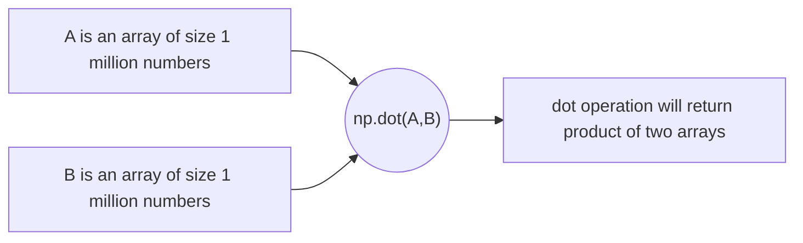
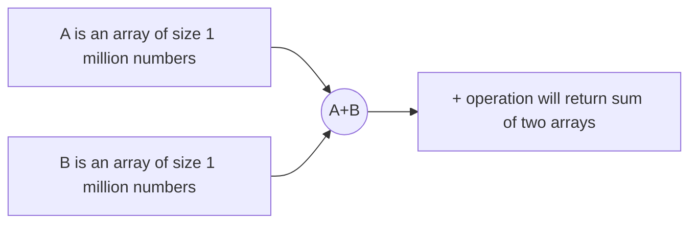

# Vectorization
In machine learning data sets can be very big and usually we use loops to do calulation on arrays.
To reduce the time in python, we have a package called numpy which can facilitates direct operation on same sized arrays much faster than loops.

## How vectorization works?
In CPU or GPU , we have capabilities like parallel processing and when we use a built in function from numpy as np.dot(), it facilitates to use maximum usage of CPU/ Hardware capabilities which makes it run faster.

### Product of two arrays

### Sum of two arrays

## References  
- [Vectorization Coursera](https://www.coursera.org/learn/neural-networks-deep-learning/home/week/2)